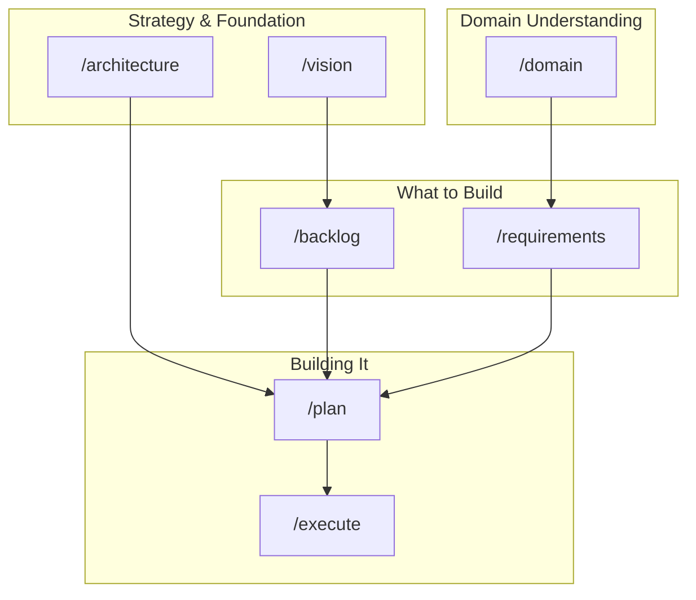
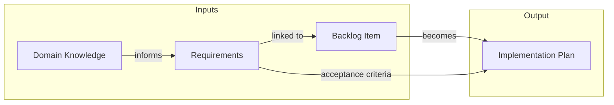
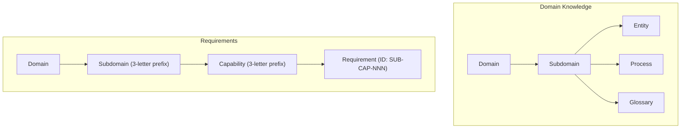

# Storm Claude Marketplace

A curated collection of Claude Code plugins, featuring the **Product Management Toolkit** - a suite of plugins that help you go from idea to implementation with structured product development practices.

## Product Management Toolkit

Build products systematically with Claude as your PM partner. The toolkit guides you through the entire product development lifecycle:



### The Workflow

**1. Start with Strategy**

- `/vision` - Define who you're building for and why it matters
- `/architecture` - Document your tech stack and key decisions (ADRs)

**2. Understand Your Domain**

- `/domain` - Capture domain knowledge: entities, processes, and glossary terms

**3. Decide What to Build**

- `/backlog` - Manage your product backlog with MoSCoW prioritization
- `/requirements` - Write BDD requirements in Gherkin (Given-When-Then)

**4. Plan and Execute**

- `/plan` - Create implementation plans from backlog items
- `/execute` - Implement the plan step by step

### How Things Connect



- **Domain Knowledge** helps you write accurate requirements (you understand the entities and rules)
- **Requirements** get linked to **Backlog Items** (what work implements what requirement)
- **Planning** pulls from both - the backlog item tells you *what* to build, requirements tell you *how it should behave*

### Domain Model

The toolkit uses a structured hierarchy for organizing domain knowledge and requirements:



**Example:**
```
Domain: Admission
└── Subdomain: Admission Rules (ADM)
    └── Capability: Grade Calculation (GRD)
        └── Requirement: ADM-GRD-001 - Calculate weighted average
```

### File-based vs Airtable

You can store your work in **markdown files** or **Airtable** - your choice:

| Approach | Best For | Commands |
|----------|----------|----------|
| **File-based** | Git-friendly, works offline, lives with code | `/vision`, `/domain`, `/backlog`, `/requirements`, `/plan` |
| **Airtable** | Visual dashboards, collaboration, filtering | `/airtable-setup`, `/domain-airtable`, `/backlog-airtable`, `/requirements-airtable`, `/plan-airtable` |

**File structure (markdown approach):**
```
your-project/
└── docs/
    ├── strategy/
    │   ├── vision.md
    │   ├── tech-stack.md
    │   ├── backlog.md
    │   └── architecture/
    │       └── 001-use-postgres.md
    ├── domains/
    │   └── admission/
    │       └── admission-rules/
    │           ├── entities/
    │           ├── processes/
    │           └── glossary/
    ├── requirements/
    │   ├── registry.md
    │   └── admission/
    │       └── admission-rules/
    │           └── grade-calculation/
    │               └── weighted-average.feature
    └── plans/
        └── user-registration.md
```

## Installation

### Option 1: Add the Marketplace

In Claude Code, run:

```
/plugins
```

Select "New marketplace", then paste:

```
git@github.com:SmidigStorm/storm-claude-marketplace.git
```

### Option 2: Command Line

```bash
claude /plugin marketplace add SmidigStorm/storm-claude-marketplace
```

### Browse and Install Plugins

After adding the marketplace:

```bash
/plugins
```

Install a specific plugin:

```bash
/plugin install pm-vision@storm-claude-marketplace
```

## Available Plugins

### Product Management Toolkit

| Plugin | Description |
|--------|-------------|
| [pm-vision](./plugins/pm-vision) | Create and maintain product vision documentation |
| [pm-architecture](./plugins/pm-architecture) | Manage tech stack and architecture decisions (ADRs) |
| [pm-domain-knowledge](./plugins/pm-domain-knowledge) | Document domain entities, processes, and glossary |
| [pm-prioritization](./plugins/pm-prioritization) | Manage product backlog with MoSCoW prioritization |
| [pm-requirements](./plugins/pm-requirements) | BDD requirements with Gherkin feature files |
| [pm-planning](./plugins/pm-planning) | Create and execute implementation plans |
| [pm-airtable-setup](./plugins/pm-airtable-setup) | Set up Airtable tables for PM plugins |

## Quick Start

**Starting a new project?** Run these in order:

1. `/vision` - Define your product vision
2. `/architecture` - Document initial tech decisions
3. `/domain` - Start capturing domain knowledge as you learn
4. `/backlog` - Add your first features
5. `/requirements` - Write requirements for a backlog item
6. `/plan` - Plan the implementation
7. `/execute` - Build it!

**Joining an existing project?** Start with `/domain` to explore what's documented, then pick up wherever the team is in the workflow.

## License

MIT
